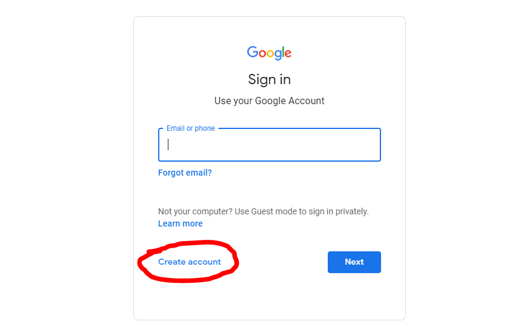
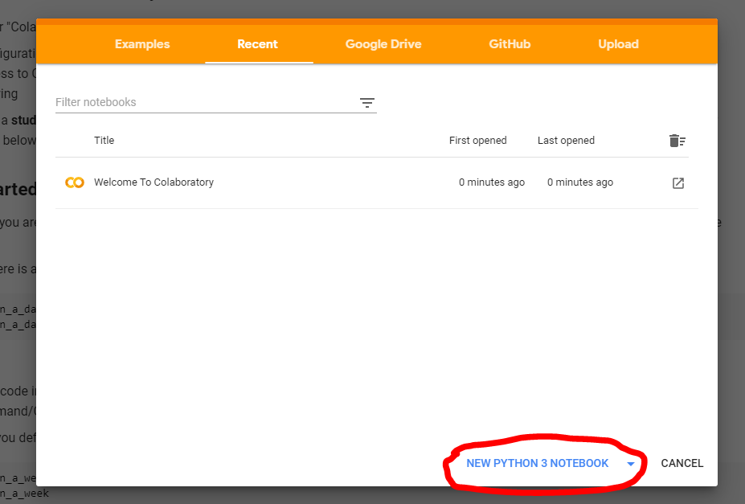
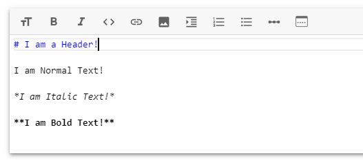
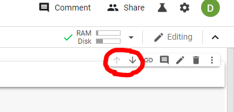

This first tutorial will take you through the steps you need to take in order to get a Google Collab Notebook up and Running.

# Creating an Account
If you already have an account on Google, go ahead and **sign into it** at [www.google.com](http://www.google.com)!

However, if you do not have a google account, you will have to **follow the Sign-up** process on Google, Hit the Sign In button shown in the image above, and then **click create account**.

# Opening Google Colab
Once you have signed in to Google, you can then head over to [colab.research.google.com](https://colab.research.google.com/) to access the Google Colab website!

At first you will be presented with a window to either Open existing Notebooks or to Create new Notebooks. We are going to create a new one so at the bottom of the window, **click `New Python 3 Notebook`**.

# Naming your Notebook
At the top of the window, **click on `Untitled0.ipynb`** and **give it a more appropriate name** like `ApplicantDay-DogClassifier.ipynb`

# Cells
Python Notebooks are made up of 2 different types of Cells:

- **Markdown Cells**
  - Markdown is a simple Mark-up Language used to format text.
  - It has a really easy syntax and is very easy to pickup.
    - `#` defines a header!
    - Surrounding Text in `*` makes it *Italic*!
    - Surrounding Text in `**` makes it **Bold**!
  - Can be used to "Visually Describe" and provide important information about your code.

- **Code Cells**
  - Used for writing and executing Python code.
  - Each code cell has an Input and an Output Block.
    - The input cell is where your code goes.
    - The output cell shows the output of your code just below the input cell.

# Creating a Cell
Your Notebook will be created with a Code cell by default, you can add extra cells by clicking either `+Text` to create a markdown cell or `+Code` to create a Code cell.

# Re-Ordering Cells
You can move cells either Up or Down by clicking on the Cell and using the Cell Controls which display on the right side of the cell.

